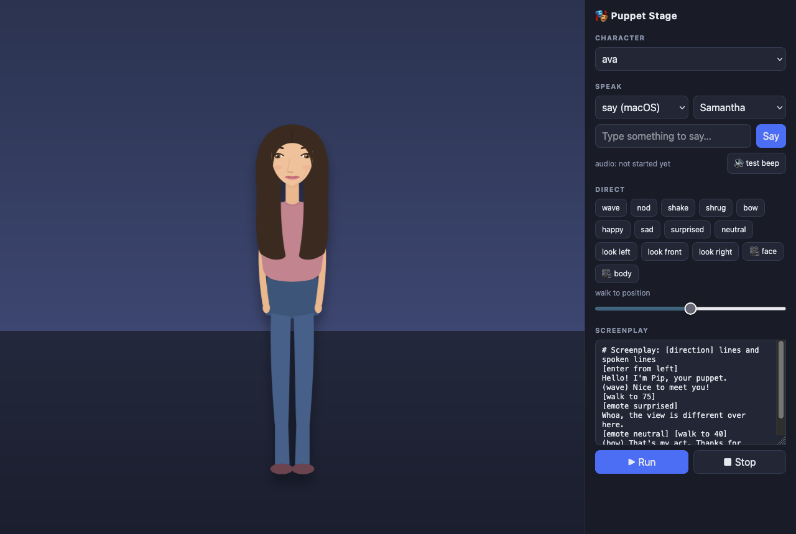
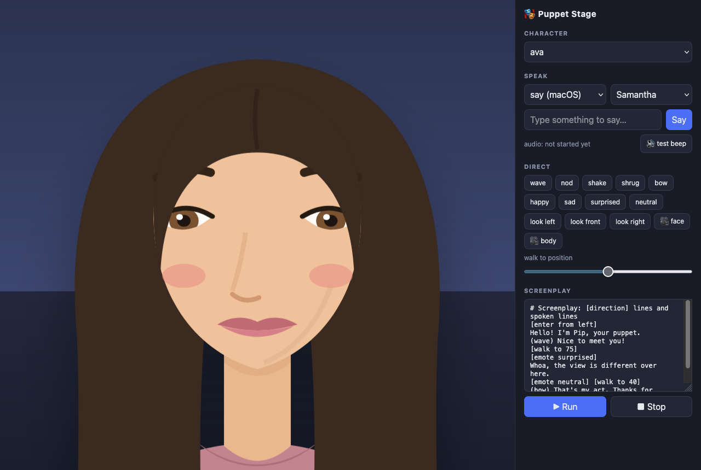
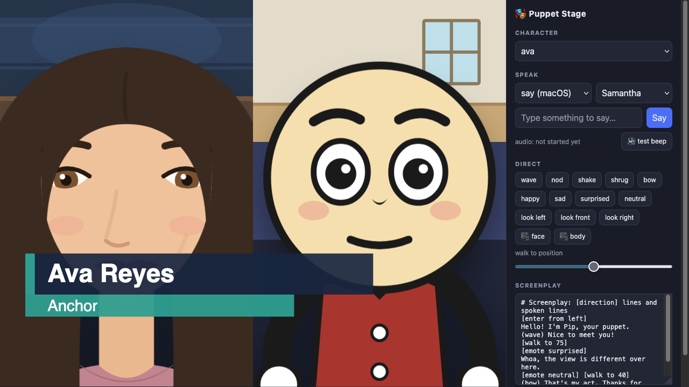

# Puppet Stage 🎭

A browser puppet with phoneme-accurate lip-sync driven by local text-to-speech
(macOS `say` or `espeak`), that takes stage direction like an actor reading a
teleprompter — walk, wave, emote, look around — live or from a screenplay.
Characters are plain SVG + JSON, so they're fully swappable without touching
code.

Zero npm dependencies. One Node server, one static page.


*Ava, mid-scene, with the control panel.*

## Quick start

```sh
./setup.sh        # downloads Rhubarb Lip Sync into tools/, checks prerequisites
node server.js    # → http://localhost:3123
```

Prerequisites: `node`, `ffmpeg` (`brew install ffmpeg`), and a TTS engine —
macOS ships `say`; otherwise `brew install espeak` / `apt install espeak`.

## How it works

```
text ──▶ say / espeak ──▶ WAV ──▶ Rhubarb Lip Sync ──▶ viseme timeline (A–H, X)
                           │                                   │
                           └────────── browser plays audio ◀───┘
                                       and swaps mouth shapes on the audio clock
```

- **Server** (`server.js`): renders speech to WAV (cached in `cache/`), runs
  [Rhubarb Lip Sync](https://github.com/DanielSWolf/rhubarb-lip-sync) to get
  mouth-shape timings, and broadcasts cues to every connected stage over
  Server-Sent Events.
- **Stage** (`public/`): plays the audio through Web Audio and schedules mouth
  shapes against the audio-context clock, so sync stays tight. If Rhubarb is
  missing or fails, it degrades to amplitude-driven mouth movement.
- **Everything is a cue.** Speech, gestures, movement, and emotes all travel
  the same bus, so the puppet can be directed from the UI, from the command
  line, or by a screenplay — and every open browser tab shows the same show.

## Screenplay language

Type into the Screenplay box and hit Run. Plain lines are spoken;
`[bracketed]` lines are stage directions; a `(parenthesised)` prefix fires an
action *while* the line is spoken. A teleprompter overlay follows along.

```
# comments start with #
[enter from left]
Hello! I'm Pip.
(wave) Nice to meet you!
[walk to 75]              # percent of stage width
[emote surprised]
Whoa!
[emote neutral] [wait 1]
[look left] [look front]
[engine espeak]           # switch TTS engine mid-script
This is my robot voice.
[engine say] [voice Samantha]
And back again.
(bow) Thanks for watching!
[exit right]
```

Directions: `walk to N`, `enter from left|right`, `exit left|right`,
`wait N`, `look left|right|up|down|front`, `emote <name>`,
`view face|body` (camera close-up / full stage), `engine say|espeak`,
`voice <name>`, `rate <n>`, or any action name from the character's manifest
(`wave`, `jump`, `nod`, `shake`, `bow`, `dance`, `shrug`, …).

Two characters ship as references: `pip`, a cartoon blob showing the minimal
contract, and `ava`, a semi-realistic young woman showing the full contract —
face view, breathing, gaze drift, and a preferred voice.

## Directing from the command line

```sh
curl -X POST localhost:3123/api/say    -H 'Content-Type: application/json' \
     -d '{"text":"Hello there","engine":"say","voice":"Samantha"}'
curl -X POST localhost:3123/api/cue    -H 'Content-Type: application/json' \
     -d '{"type":"action","name":"wave"}'
curl -X POST localhost:3123/api/cue    -H 'Content-Type: application/json' \
     -d '{"type":"walk","x":80}'
curl -X POST localhost:3123/api/script -H 'Content-Type: application/json' \
     -d '{"script":"[wave]\nHello!"}'
curl -X POST localhost:3123/api/script/stop
```

Other endpoints: `GET /api/characters`, `GET /api/voices?engine=say|espeak`,
`GET /api/events` (the SSE cue stream, if you want to build another stage).

## Integrating your own TTS / STT

If you already have a text-to-speech service, skip the built-in engines and
post its rendered audio directly — the server lip-syncs it and plays it on
every connected stage. Any format ffmpeg can read works; passing the
transcript as `?text=` makes the lip-sync noticeably more accurate:

```sh
curl -X POST --data-binary @line.mp3 \
     'http://localhost:3123/api/speak-audio?text=Hello%20there'
```

For speech-to-text, the loop is simply: transcribe → decide a reply →
`POST /api/say` (or `/api/speak-audio`), sprinkling `/api/cue` gestures as
desired. The stage doesn't care where words come from.

## Making a new character

A character is a folder in `characters/<name>/` with two files — no code:

- **`puppet.svg`** — artwork with named parts. Required: one group per
  Rhubarb viseme (`#mouth-A` … `#mouth-H`, plus `#mouth-X` for rest).
  Everything else is up to you.
- **`manifest.json`** — the contract the runtime animates against:
  - `mouths`: viseme letter → CSS selector of that mouth shape
  - `blink`: `{ "target": "#eyes" }` (automatic eyelid loop)
  - `look`: `{ "target": ".iris", "dx": 5, "dy": 2 }` (selector may match
    several elements)
  - `walk`: `{ "speed": 230, "bob": true }`
  - `views`: camera framings, e.g.
    `{ "face": { "focus": "#head", "fill": 0.62, "centerY": 0.48 } }` —
    enables the face close-up (`[view face]` / `[view body]` in scripts,
    🎥 buttons in the UI). Defaults to framing `#head` if omitted.

    
    *`[view face]` zooms the camera to the head framing.*
  - `idle`: ambient life while not speaking, e.g.
    `{ "breathe": { "target": "#torso", "amount": 1.4, "period": 4200 },
    "gaze": true }` (gaze randomly drifts the `look` target)
  - `voice`: preferred TTS, e.g. `{ "engine": "say", "voice": "Samantha" }` —
    selected automatically when the character loads
  - `actions`: named animations, each a list of Web-Animations tracks:
    `{ "target": "#arm-right", "duration": 1600, "keyframes": [...] }`.
    Add `"fill": "forwards"` on a track to hold a pose (emotes), and an
    action with `"reset": true` to clear held poses (see `neutral`).

The stage builds its Direct buttons from the manifest, so a character with
different abilities automatically gets different controls. Parts that rotate
should carry `style="transform-box:fill-box;transform-origin:..."` in the SVG
(see how `pip`'s arms pivot at the shoulder).

The nine visemes are Rhubarb's standard set: **A** closed (m/b/p), **B**
slightly open with teeth, **C** open, **D** wide open, **E** rounded, **F**
puckered (oo), **G** teeth on lip (f/v), **H** tongue up (l), **X** rest.

## Scenes, frames & overlays

The stage isn't limited to one character in one box. A **frame** is an
independent framed region with its own background, content, character, and
camera; the screen holds one or more of them side by side (a news two-box, an
interview, picture-in-picture). A single talking head is just one frame at
full size — the default — so every existing script and API call keeps
working unchanged.


*Ava and a vintage rubber-hose-style character, Bo, framed separately with different backgrounds and a broadcast lower-third.*

```text
[layout split]
[frame left character:ava bg:desk view:face]
[frame right character:bo bg:room view:face]
left: Good evening.
right: Thanks for having me.
[left wave]
[scene desk]
[show image:chart fit:contain]
[lower-third "Ava Reyes" "Host"]
```

`left:` / `right:` as a line prefix targets that frame's speaker; a
`[frame ...]` direction creates or updates a frame. New cue types for API
users: `frame`, `frame-clear`, `layout`, `content`, `scene`, `overlay` —
existing character cues (`speak`, `action`, `walk`, `look`, `view`,
`character`) now also accept an optional `frame` field.

A starter asset pack ships in `assets/`: backgrounds `desk`, `sky`, and
`room`, a few props, and the `lower-third` overlay template, plus a second
character, `bo`, in a vintage rubber-hose style. See
[docs/authoring-assets.md](docs/authoring-assets.md) for adding your own, and
[docs/design/frames-and-scenes.md](docs/design/frames-and-scenes.md) for the
full cue schema and screenplay grammar.

## Notes & troubleshooting

- **Safari and sound.** Browsers block audio that isn't triggered by a click,
  and speech cues arrive over SSE. The stage unlocks audio on your first
  click or keypress (including Safari's extra silent-buffer ritual). If
  speech is ever silent, use the **🔊 test beep** next to the Speak box: beep
  silent too → browser/system output problem; beep audible → file an issue.
- Rendered speech is cached in `cache/`, keyed by engine + voice + text.
  Safe to delete anytime.
- Rhubarb's macOS build is x86_64; it runs under Rosetta on Apple Silicon.
- Without Rhubarb the app still works — mouths fall back to loudness-driven
  movement instead of phoneme shapes.
- `http://localhost:3123/?shot` delays page-load completion ~3 s so headless
  browser screenshots capture the fully booted stage.

## License

MIT — see [LICENSE](LICENSE). Rhubarb Lip Sync is a separate MIT-licensed
project by Daniel Wolf, downloaded by `setup.sh` rather than vendored here;
its license permits commercial use.
